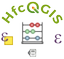
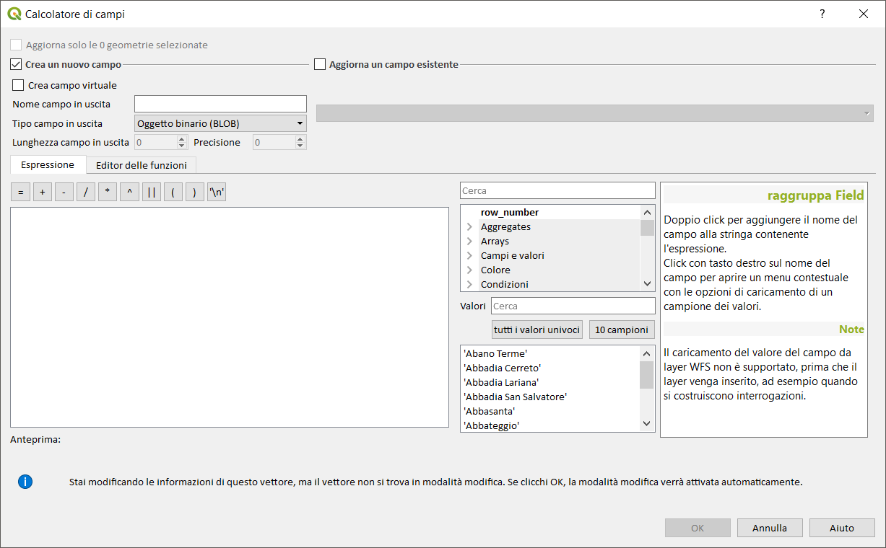
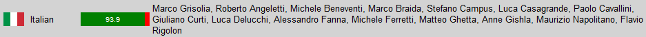
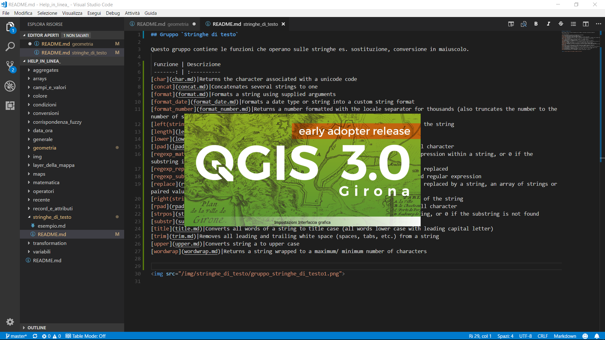

#  Help funzioni calcolatore di campi di QGIS (HfcQGIS)

Questa guida nasce per rispondere alle numerose richieste di aiuto sull'uso del calcolatore di campi e per colmare un vuoto sulla guida online di QGIS con esempi e molti screenshot.

## Indice gruppi di funzioni/espressioni (302/397)

Gruppo funzioni|nro funzioni|info
---------------|:----------:|----
[Aggregates](./gr_funzioni/aggregates) |(22/22)| >= QGIS 2.16  
[Arrays](./gr_funzioni/arrays)| (31/31) |>= QGIS 3.0 (SpatiaLite, PostGIS) - ArrayPlus Plugin
[Campi e valori](./gr_funzioni/campi_e_valori)| (1/1)|
[Colore](./gr_funzioni/colore)| (17/17)|
[Condizioni](./gr_funzioni/condizioni)| (4/4)|
[Conversioni](./gr_funzioni/conversioni)| (7/7)|
[Corrispondenza fuzzy](./gr_funzioni/corrispondenza_fuzzy)| (4/4)|
[Custom](./gr_funzioni/custom)| (4/4)| funzioni personalizzate
[Data e ora](./gr_funzioni/data_ora) |(16/16)|
[Generale](./gr_funzioni/generale)| (7/7)|
[Geometria](./gr_funzioni/geometria) |(97/97)| aggiornate a QGIS 3.2
[Layer della mappa](./gr_funzioni/layer_della_mappa)| (1/1)| >= QGIS 3.0
[Maps](./gr_funzioni/maps)| (10/10) |>= QGIS 3.0 (PostGIS) - ArrayPlus Plugin
[Matematica](./gr_funzioni/matematica)| (28/28)|
[Operatori](./gr_funzioni/operatori)| (21/21)|
[Recente](./gr_funzioni/recente) |(1/1)|
[Record e attributi](./gr_funzioni/record_e_attributi)| (10/10)|
[Reference](./gr_funzioni/reference)| (0/21)| [Plugin refFunction](https://plugins.qgis.org/plugins/refFunctions/)
[Stringhe di testo](./gr_funzioni/stringhe_di_testo)| (22/22)|
[TimeManager](./gr_funzioni/timemanager)| (0/5)| Plugin Time Manager
[Transformation](./gr_funzioni/transformation)| (0/4)| Plugin refFunction
[Variabili](./gr_funzioni/variabili) |(0/64) |>= QGIS 2.12

## Calcolatore di campi

* [Concetti](./calcolatore_campi/concetti.md) Concetti base sul calcolatore di campi
* [Linguaggio](https://gis.stackexchange.com/questions/247474/what-language-do-qgis-expressions-use-what-language-should-qgis-queries-be-writ) Che linguaggio usa il calcolatore di campi?
* [Interfaccia](./calcolatore_campi/interfaccia.md) Introduzione all'interfaccia calcolatore di campi
* [Operatori](./calcolatore_campi/operatori.md) - Operatori presenti nell'interfaccia del calcolatore
* [Esempi](./esempi) (10) - Esempi dettagliati sull'uso delle funzioni

---
## Novità rilevanti introdotte in QGIS 3.2 Bonn 22/06/2018
* [Il generatore di espressioni ora semplifica la creazione di espressioni in QGIS!](https://github.com/pigreco/HfcQGIS/blob/master/novita_3.2.md#novit%C3%A0-rilevanti-introdotte-nella-32)
* [Form drill-down (a cascata) WIDGET Value Relation (Relazione valore)](https://github.com/pigreco/HfcQGIS/blob/master/novita_3.2.md#feature-form-drill-down-a-cascata--widget-value-relation-relazione-valore)

---
## [Cosa puoi fare](/CONTRIBUTING.md) ❔

- *contribuire* 💳📣
    - [finanziariamente*](https://www.paypal.me/pigrecoinfinito);
    - [condividendo e divulgando](https://www.facebook.com/) usare HashTag **#hfcqgis**;
- *segnalare errori* ⚠️
    - [tramite issues](https://github.com/pigreco/HfcQGIS/issues);
- *aggiungere funzioni* 🎫
    - [tramite pull requests](https://github.com/pigreco/HfcQGIS/pulls);
    - [tramite issues](https://github.com/pigreco/HfcQGIS/issues);
- *aggiungere esempi* 📝
    - [tramite pull requests](https://github.com/pigreco/HfcQGIS/pulls)
- *lasciare un messaggio* 📝💭 ✉️ 📮
    - [scrivi un messaggio qui](https://github.com/pigreco/HfcQGIS/issues/1)

## Come puoi usare questo lavoro

* [Github](https://github.com/pigreco/HfcQGIS)
* Ebook 🕮 (a breve!!!)
* Read the Docs 🕮 (a breve!!!)

## Traduzione in italiano

La descrizione delle funzioni in italiano è stata realizzata dal gruppo di traduttori diretti da [Stefano Campus](https://twitter.com/skampus1967?lang=it)

## link

* [QGIS.org](https://qgis.org/it/site/)
* [Documentazione](https://qgis.org/it/docs/index.html#)
* [Pigrecoinfinito - mio Blog](https://pigrecoinfinito.wordpress.com/)
* [GeoGebra](https://www.geogebra.org/?lang=it)

## Licenze

Se non specificato diversamente, tutti i contenuti sono soggetti alla licenza: [Creative Commons Attribution-ShareAlike 4.0 licence (CC BY-SA)](https://creativecommons.org/licenses/by-sa/4.0/)

## Donate

💶 [HfcQGIS](https://www.paypal.me/pigrecoinfinito) 💶 💳

\* il X % sarà donato a **QGIS.it** 

## ©️ Autore `HfcQGIS`

* [Salvatore Fiandaca](https://twitter.com/totofiandaca?lang=it) (aka _Totò_)

## Ringraziamenti

* [Andrea Borruso](https://twitter.com/aborruso?lang=it) per il supporto tecnico GitHub, VScode, Markdown e gitbook;

## Repo costruito con:

* [Visual Studio code](https://it.wikipedia.org/wiki/Visual_Studio_Code)

* Video demo su come utilizzare la guida

