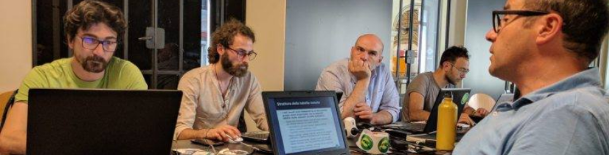
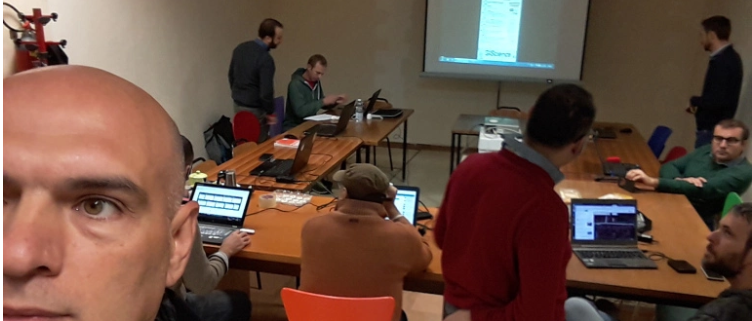

# Bio

Salvatore **FIANDACA** (_aka `pigreco`, per gli amici `Totò`_)

Usa spesso, nei vari social, il nick name pigreco ma è nel titolo del suo blog - pigrecoinfinito - che si cela il suo nome in siciliano. Per capire quale sia occorre osservare con attenzione il logo che lo rappresenta:

sono sovrapposti i simboli di pi greco, dell'infinito e della derivata prima: tre simboli matematici che hanno rivoluzionato la scienza; se osservate bene vedrete scritto il suo nome. 

Prima di iniziare l'attività di divulgatore del Open Source (OS), _Salvatore_ ha utilizzato - per anni - software proprietari, solo dopo la scoperta del OS abbandonò definitivamente il mondo Close Source e decise di divulgare la filosofia OS tramite blog post e video su youtube. Attualmente il blog è seguito in tutto il mondo ed il canale youtube ha oltre 1000 iscritti.

Libero Professionista, attualmente è socio [GFOSS.it](http://gfoss.it/), membro di [QGIS Italia](https://www.facebook.com/qgis.it/) e moderatore di vari forum con argomenti GFOSS. Partecipa, nel 2014, alla fondazione di _Open Data Sicilia_ realizzando uno dei primi progetti del gruppo (Balneazione Palermo 2014, [Piano regolatore del Comune di Palermo 2015](http://blog.spaziogis.it/static/palermo_prg/#12/38.1375/13.3450)), nel 2016 è tra i relatori del [#ODS16 OpenDataSicilia Summer Edition](http://ods16.opendatasicilia.it/) Messina, in cui parla di QGIS.

Cura il Blog '[Pigrecoinfinito](https://pigrecoinfinito.wordpress.com/)' e il [canale](https://www.youtube.com/user/vediamo13/) YouTube dove scrive e parla di QGIS, SpatiaLite, PostegreSQL/PostGIS, GDAL/OGR, GRASS GIS, SAGA GIS, GitHub, OSGeo4W, ed altri FOSS; ama usare, nella professione e non solo, software OS come LibreOffice, InkSCAPE, GIMP ecc...

**_Salvatore_ è disponibile per nuovi progetti di divulgazione, oltre a consulenze private.**

Puoi raggiungere _Salvatore_ all'indirizzo [@pigrecoinfinito](https://pigrecoinfinito.wordpress.com/dove-mi-trovo/)

Molto attivo nella comunita di QGIS: ha partecipato alla realizzazione di un plugin ([Select by Relationship](https://plugins.qgis.org/plugins/SelectByRelationship/)); utilizza la _OSGeo4W Network installer_ per fare testing sulle versione dev di QGIS; ha aperto numerosi ticket nel [QGIS Issue Tracking](https://issues.qgis.org/issues); scrive nelle mailing list di: QGIS-it-user, GFOSS, Spatialite, gvSIG; è co-admin della pagina ufficiale di [QGIS Italia](https://www.facebook.com/qgis.it/); ha collaborato per i testing di nuove feature di QGIS;si diverte a  compilare la versione QGIS dev su GNU/Linux MINT; ha realizzato Pull request (PR) nel progetto princiaple di [QGIS](https://github.com/qgis/QGIS); è iscritto a [gis.stackexchange](https://stackexchange.com/users/8482031/pigreco). Ha organizzato e partecipato alle prime due Hack Fest QGIS Italia realizzate a [Bologna](https://pigrecoinfinito.wordpress.com/2017/05/27/qgis-prima-hackfest-italiana-di-qgis/) e [Padova](https://pigrecoinfinito.wordpress.com/2017/11/14/qgis-seconda-hackfest-italiana-di-qgis/) (2017) e parteciperà alla [prossima a Viterbo (2018)](https://github.com/pcav/sito_qgis_it/wiki/QGIS-HackFest-3).

**Foto**: Hack Fest QGIS ITA Bologna 2017, da sinistra: _Luca Mandolesi, Giuseppe Guarino, Salvatore Fiandaca, Pierluigi de Rosa e Enrico Ferreguti (uno dei più attivi sviluppatori di plugin italiani_

**Foto**: Hack Fest QGIS ITA Padova 2017, da sinistra: _Salvatore Fiandaca, Amedeo Fadini, Federico Gianoli, Matteo Ghetta,prof. Massimo De Marchi, Stefano Campus, Alessandro Sarretta, Enrico Ferreguti_

