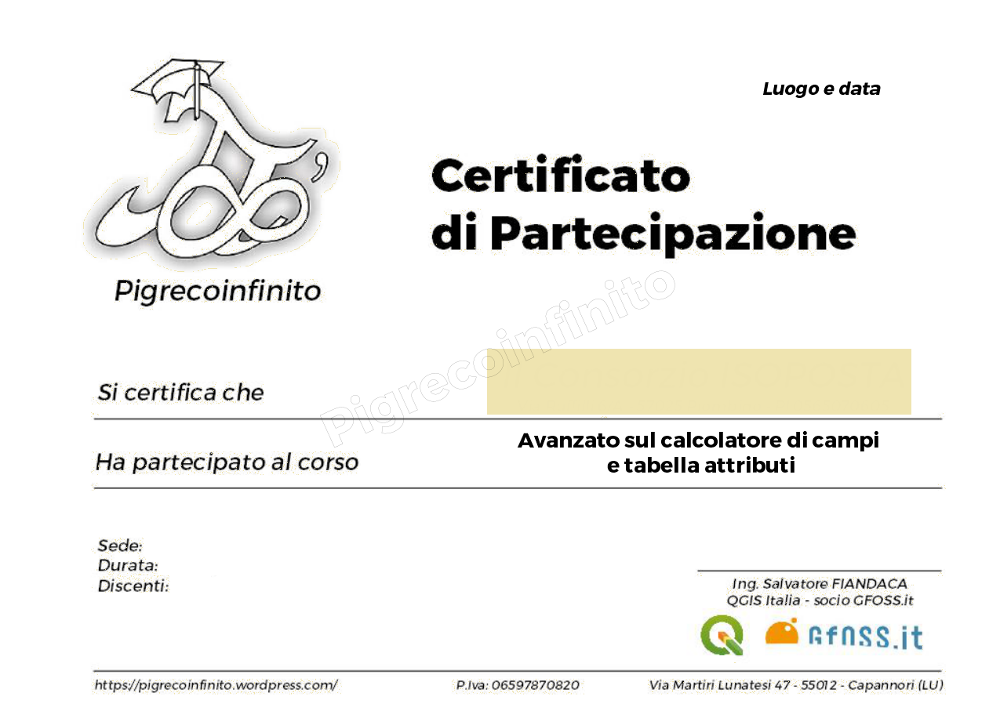

# Corso di formazione sul field calc di QGIS

## A chi è rivolto

Il corso è rivolto agli utenti che conoscono l'uso generale di QGIS e desiderano approfondire l'uso della tabella attributi e del calcolatore di campi.

## Durata del corso

Il corso è strutturato per durare almeno 16 ore - preferibilmente fulltime (due giorni da otto ore)

## Programma Corso

1. Tabella attributi;
   1. Concetti fondamentali sulla Tabella attributi
   2. che cosa è la tabella attributi;
   3. campi e record, come definirli;
   4. Icone e funzioni tabella attributi;
   5. calcolatore di campi rapido;
   6. tabella attributi e tipo formato GIS cosa cambia:
      1. shapefile;
      2. geojson;
      3. geopackage;
      4. spatialite.
   7. Vista tabella e vista modulo, le relazioni;
   8. riorganizzazione campi tabella - processing;
   9. selezione per espressione;
   10. esercitazioni.
2. Calcolatore di campi;
   1. Concetti fondamentali sul Calcolatore di campi;
   2. Interfaccia;
   3. gruppo funzioni;
   4. guida in linea e #HfcQGIS;
   5. le funzioni geometriche;
   6. come creare delle espressioni complesse;
   7. come richiamare altri layer;
   8. come aggiungere attributi geometrici alla tabella;
   9. le funzioni di aggregazione;
   10. le variabili;
   11. aggiornare un campo esistente;
   12. campi virtuali, utilità;
   13. filtro;
   14. cenni sull'editor delle funzioni python;
   15. esercitazione.
3.  Novità introdotte in QGIS 3.x
4.  Esercitazioni.

## Contatti

- `Mail`: pigrecoinfinito@gmail.com
- `Facebook`: https://www.facebook.com/pigreco314
- `Twitter`: https://twitter.com/totofiandaca
- `Telegram`: https://t.me/pigreco71
  
## certificato di partecipazione

Alla fine del corso verrà rialsciato un certificato di partecipazione al corso.

