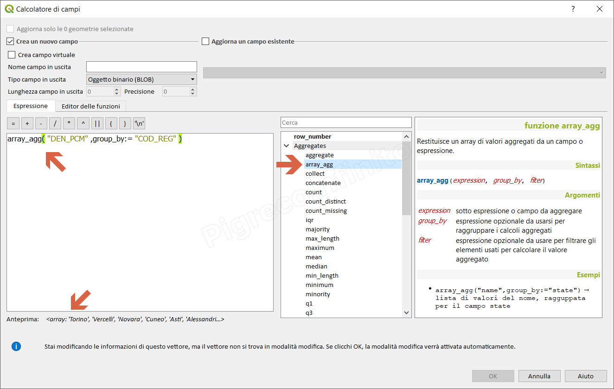

# array\_agg

## Funzione `array_agg`

Restituisce un array di valori aggregati da un campo o espressione.

## Sintassi

array_agg\(\_expression, group\_by, filter_\)

## Argomenti

* _expression_ sotto espressione o campo da aggregare
* _group\_by_ espressione opzionale da usarsi per raggruppare i calcoli aggregati
* _filter_ espressione opzionale da usare per filtrare gli elementi usati per calcolare il valore aggregato

## Esempi

* `array_agg( "DEN_PCM" ,group_by:= "COD_REG" ) → lista di valori del "DEN_PCM", ragguppata per il campo "COD_REG"`

## nota bene

--

## osservazioni

--

