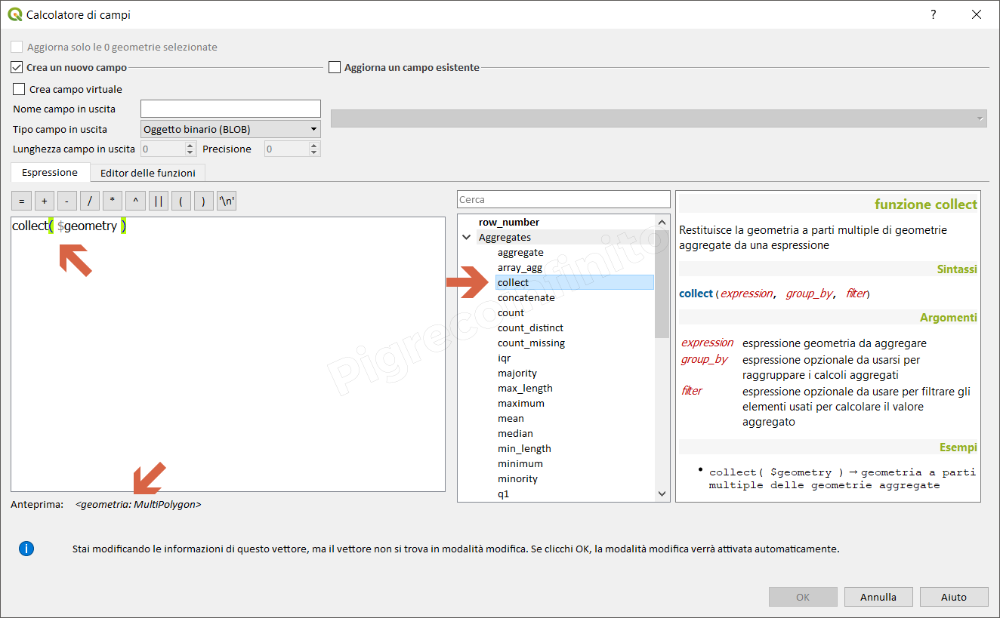

# collect

## Funzione `collect`

Restituisce la geometria a parti multiple di geometrie aggregate da una espressione

## Sintassi

collect\(_expression, group\_by, filter_\)

## Argomenti

* _expression_ espressione geometria da aggregare
* _group\_by_ espressione opzionale da usarsi per raggruppare i calcoli aggregati
* _filter_ espressione opzionale da usare per filtrare gli elementi usati per calcolare il valore aggregato

## Esempi

* `collect( $geometry ) → geometria a parti multiple delle geometrie aggregate`

## nota bene

--

## osservazioni

--

