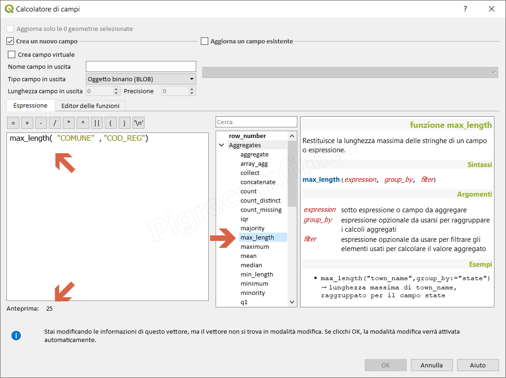

# max\_length

## Funzione `max_length`

Restituisce la lunghezza massima delle stringhe di un campo o espressione.

## Sintassi

max_length\(\_expression, group\_by, filter_\)

## Argomenti

* _expression_ sotto espressione o campo da aggregare
* _group\_by_ espressione opzionale da usarsi per raggruppare i calcoli aggregati
* _filter_ espressione opzionale da usare per filtrare gli elementi usati per calcolare il valore aggregato

## Esempi

* `max_length("COMUNE", "COD_REG")  → lunghezza massima di "COMUNE", raggruppato per il campo "COD_REG"`

## nota bene

La sintassi prevede due possibilità: 1. quella classica, senza l'uso dei paramentri denominati \(l'ordine è fondamentale\); 1. max_length\(\_expression, group\_by, filter_\) 2. con i parametri denominati \(l'ordine non è più fondamentale\): 1. max\_length\(filter:= ,\_expression:= ,group\_by:= \)

## osservazioni

--

