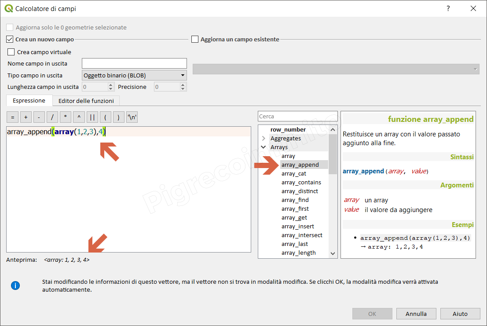

# array\_append

## Funzione `array_append`

Restituisce un array con il valore passato aggiunto alla fine.

## Sintassi

array_append\(\_array, value_\)

## Argomenti

* _array_ un array
* _value_ il valore da aggiungere

## Esempi

* `array_append(array(1,2,3),4) → array: 1,2,3,4`

## nota bene

--

## osservazioni

--

