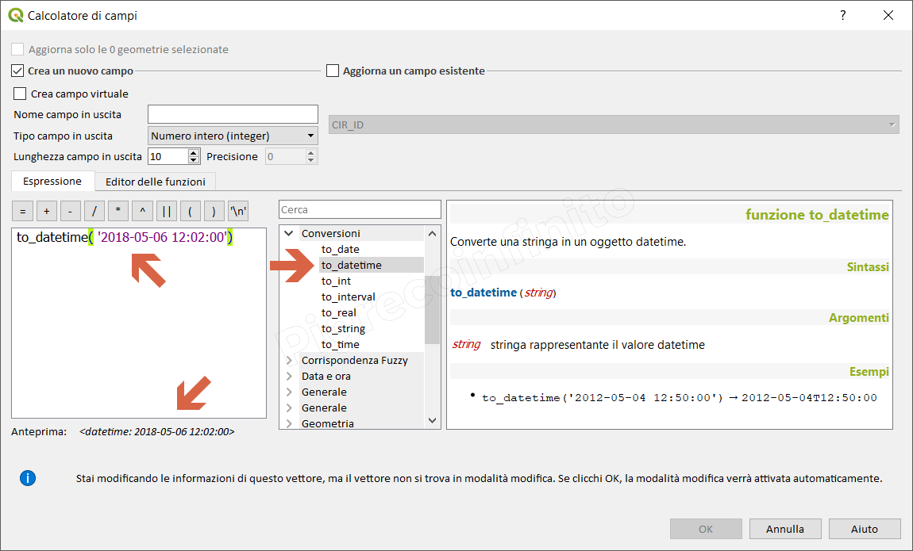

# to\_datetime

## funzione `to_datetime`

Converte una stringa in un oggetto datetime.

## Sintassi

* to_datetime\(\_string_\)

## Argomenti

* _string_ stringa rappresentante il valore datatime

## Esempi

```text
to_datetime( '2018-05-06 12:02:00') → 2018-05-06T12:02:00
```



