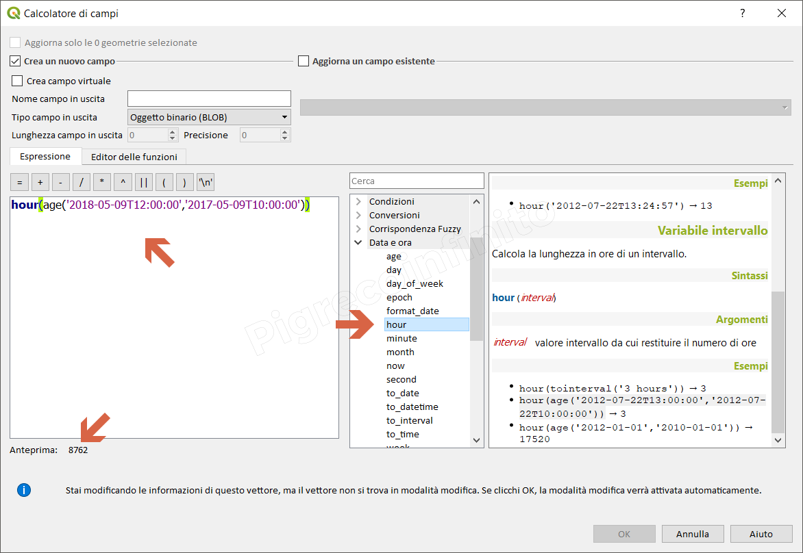

# hour

## funzione `hour`

Estrae la parte ore da una data/ora o orario, o il numero delle ore da un intervallo.

## Variabile ora

Estrae la parte ore da un orario o data/ora.

## Sintassi

* hour\(_datetime_\)

## Argomenti

* _datetime_ un valore data o data/ora

## Esempi

```text
* hour(to_datetime('2018-05-09T11:58:57')) → 11
```


## Variabile intervallo

Calcola la lunghezza in ore di un intervallo.

## Sintassi

* hour\(_interval_\)

## Argomenti

* _interval_ valore intervallo da cui restituire il numero di ore

## Esempi

```text
hour(tointerval('3 hours')) → 3
hour(age('2012-07-22T13:00:00','2012-07-22T10:00:00')) → 3
hour(age('2012-01-01','2010-01-01')) → 17520
```



