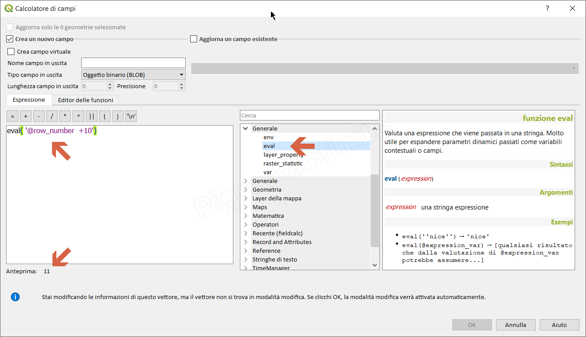

# eval

## funzione `eval`

Valuta una espressione che viene passata in una stringa. Molto utile per espandere parametri dinamici passati come variabili contestuali o campi.

## Sintassi

* eval\(_expression_\)

## Argomento

* _expression_ una stringa espressione

## Esempi

```text
eval(''nice'') → 'nice'
eval(@expression_var) → [qualsiasi risultato che dalla valutazione di @expression_var potrebbe assumere...]
eval( '@row_number  +10') → 11
```



