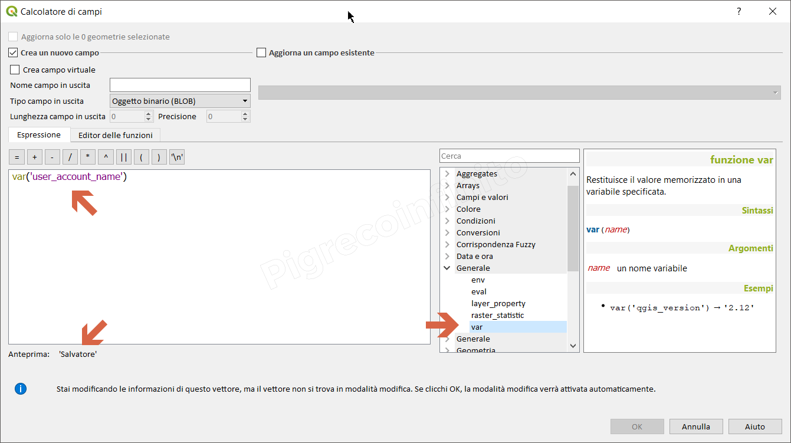

# var

## funzione `var`

Restituisce il valore memorizzato in una variabile specificata.

## Sintassi

* var\(_name_\)

## Argomento

* _name_ un nome variabile

## Esempi

```text
var('qgis_version') → '3.0.2-Girona'
var('user_account_name') → 'Salvatore'
```

## Osservazioni

Come argomento va usato il nome della variabile senza la chioccila altrimenti non funziona.



