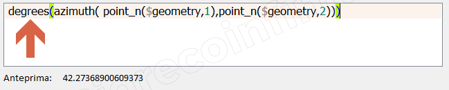

# azimuth

## Funzione `Azimuth`

Restituisce l'azimut dal nord quale angolo in radianti misurato in senso orario dalla verticale del punto\_a al punto\_b.

## Sintassi

azimuth\(_point\_a, point\_b_\)

## Argomenti

* _point\_a_ geometria punto
* _point\_b_ geometria punto

## Esempi

## nota bene

Azimuth per definizione restituisce un angolo in radianti, per trasformarlo in gradi usare la funzione degrees\(\)

