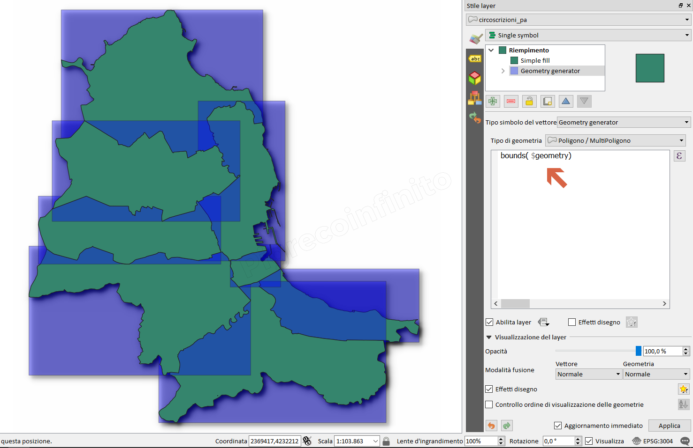

# bounds

## Funzione `bounds`

Restituisce la geometria che rappresenta il perimetro di delimitazione di una geometria in ingresso. I calcoli sono effettuati nel sistema di riferimento spaziale di tale geometria.

## Sintassi

bounds\(_geometry_\)

## Argomenti

geometry una geometria

## Esempi

`bounds($geometry) → perimetro di delimitazione di $geometry`

## nota bene

--

## osservazioni

funzione molto utile per la tematizzazione aggiungendo un nuovo layer con geometry generator

