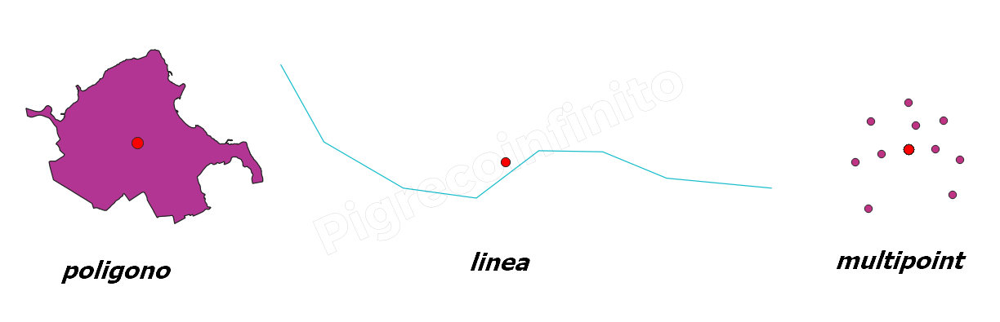

# centroid

## Funzione `centroid`

Restituisce il centro geometrico di una geometria.

## Sintassi

centroid\(_geometry_\)

## Argomenti

* _geometria_ una geometria

## Esempi

`centroid($geometry) → una geometria punto`

## nota bene

--

## osservazioni

La Funzione restituisce SEMPRE una geometry POINT

