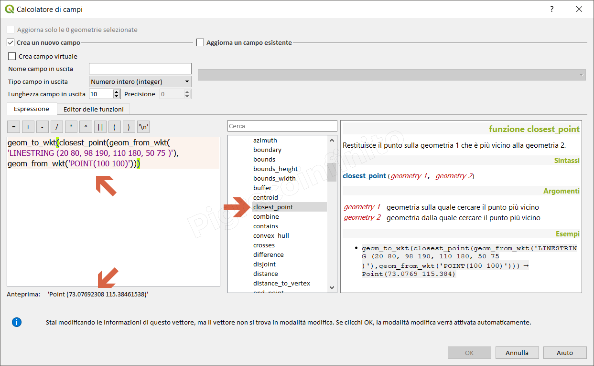
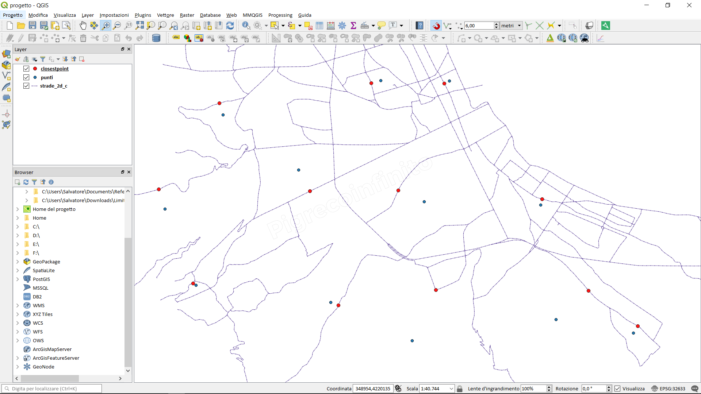

# closest\_point

## Funzione `closest_point`

Restituisce il punto sulla geometria 1 che è più vicino alla geometria 2.

## Sintassi

closest_point\(\_geometry 1, geometry 2_\)

## Argomenti

* _geometry 1_ geometria sulla quale cercare il punto più vicino
* _geometry 2_ geometria dalla quale cercare il punto più vicino

## Esempi

* `geom_to_wkt(closest_point(geom_from_wkt('LINESTRING (20 80, 98 190, 110 180, 50 75 )'),geom_from_wkt('POINT(100 100)'))) → Point(73.0769 115.384)`

## nota bene

--

## osservazioni

Utilizzando il _geometry generator_ per i temi \(il layer strade è una unica feature\):

* `closest_point( geometry(get_feature('strade', 'reg',19)),$geometry)`

Gif animata: _geometry 1_ è la rete stradale; _geometry 2_ sono i punti; in rosso i closestpoint

