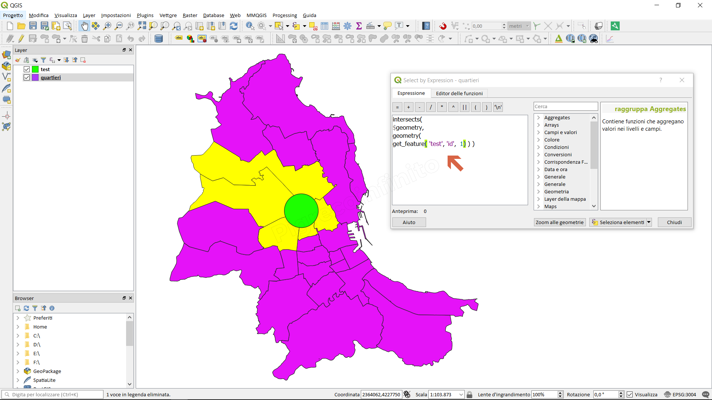

# geometry

## Funzione `geometry`

Restituisce la geometria di un elemento.

## Sintassi

geometry\(_feature_\)

## Argomenti

* _feature_ un oggetto geometria

## Esempi

* `geom_to_wkt( geometry( get_feature( layer, attributeField, value ) ) ) → 'POINT(6 50)'`
* `intersects( $geometry, geometry( get_feature( layer, attributeField, value ) ) ) → vero`

## nota bene

--

## osservazioni

--

Usando il **Select by Expression**: selezionare le feature di un layer \(quartieri\) in funzione di altro layer \(test\):

