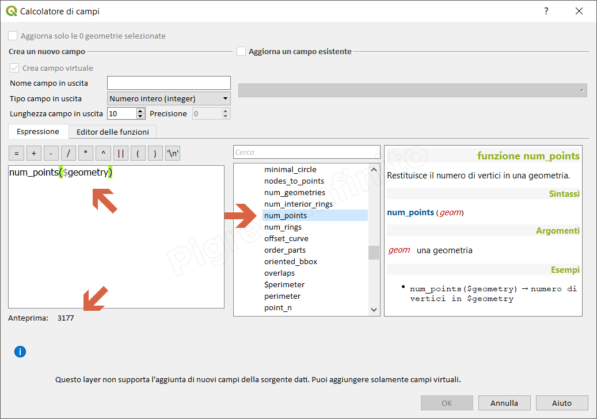

# num\_points

## Funzione `num_points`

Restituisce il numero di vertici in una geometria.

## Sintassi

num\_points\(geometry\)

## Argomenti

* _geometry_ una geometria

## Esempi

* `num_points($geometry) → numero di vertici in $geometry`

## nota bene

--

## osservazioni

--

