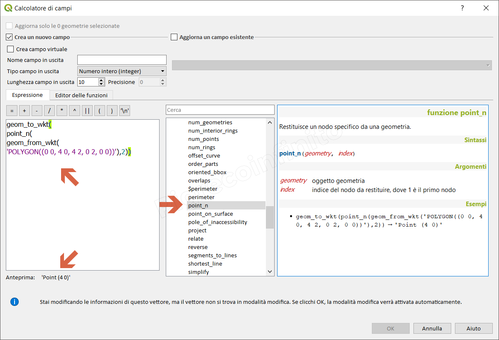
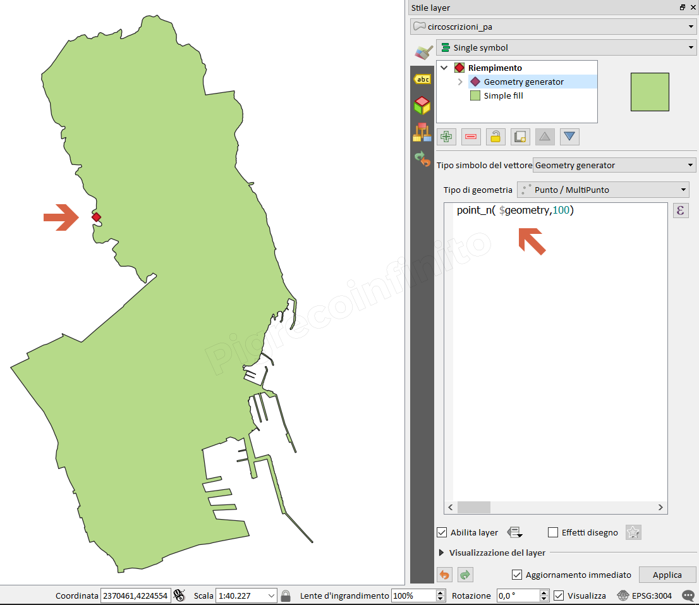

# point\_n

## Funzione `point_n`

Restituisce un nodo specifico da una geometria.

## Sintassi

point\_n\(geometry, index\)

## Argomenti

* _geometry_ oggetto geometria
* _index_ indice del nodo da restituire, dove 1 è il primo nodo

## Esempi

* `geom_to_wkt(point_n(geom_from_wkt('POLYGON((0 0, 4 0, 4 2, 0 2, 0 0))'),2)) → 'Point (4 0)'`

## nota bene

--

## osservazioni

--

