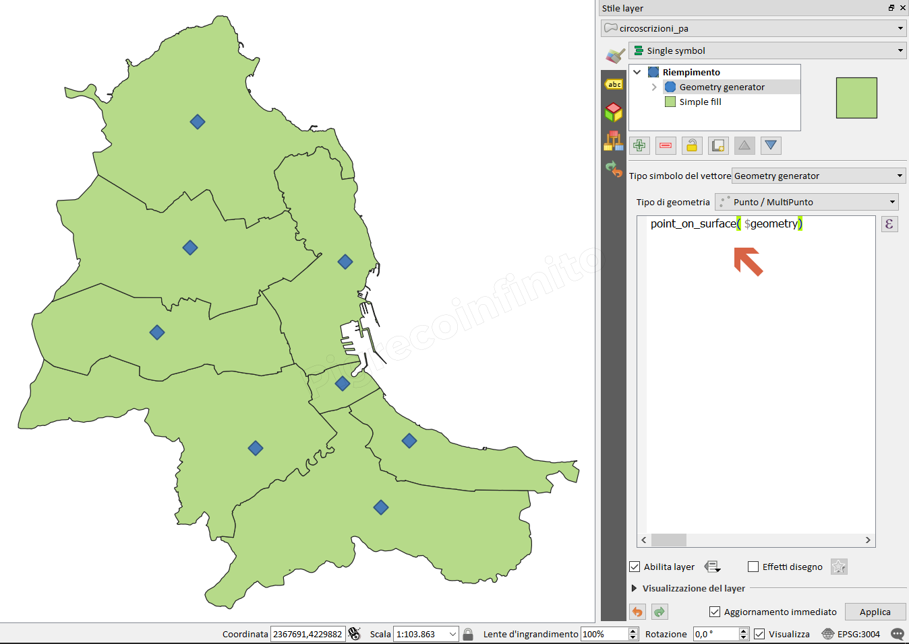

# point\_on\_surface

## Funzione `point_on_surface`

Restituisce un punto garantendo che sia giacente sulla superficie della geometria.

## Sintassi

point_on\_surface\(\_geometry_\)

## Argomenti

* _geometry_ una geometria

## Esempi

* `point_on_surface($geometry) → una geometria punto`

## nota bene

--

## osservazioni

--

