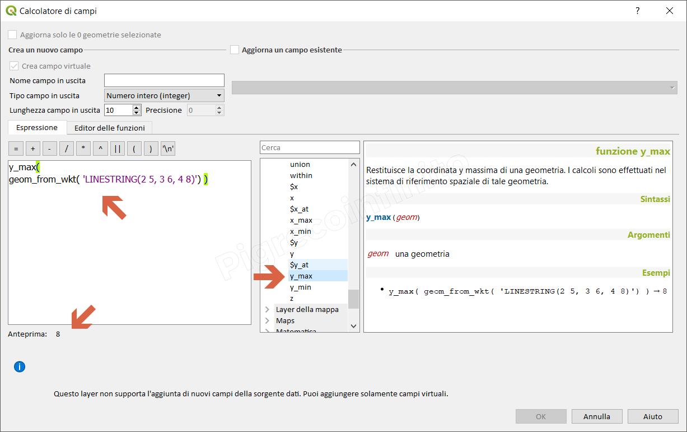

# y\_max

## Funzione `y_max`

Restituisce la coordinata y massima di una geometria. I calcoli sono effettuati nel sistema di riferimento spaziale di tale geometria.

## Sintassi

y_max\(\_geometry_\)

## Argomenti

* _geometry_ una geometria

## Esempi

* `y_max( geom_from_wkt( 'LINESTRING(2 5, 3 6, 4 8)') ) → 8`

## nota bene

--

## osservazioni

--

