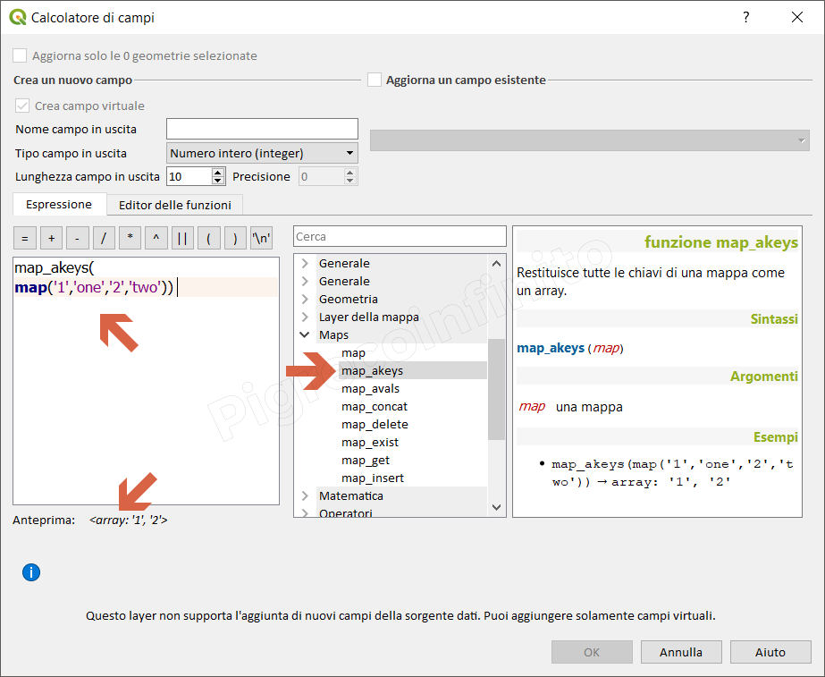

# map\_akeys

## Funzione `map_akeys`

Restituisce tutte le chiavi di una mappa come un array.

## Sintassi

map_akeys\(\_map_\)

## Argomenti

* _map_ una mappa

## Esempi

* `map_akeys(map('1','one','2','two')) → array: '1', '2'`

## nota bene

--

## osservazioni

--

## Altri esempi

