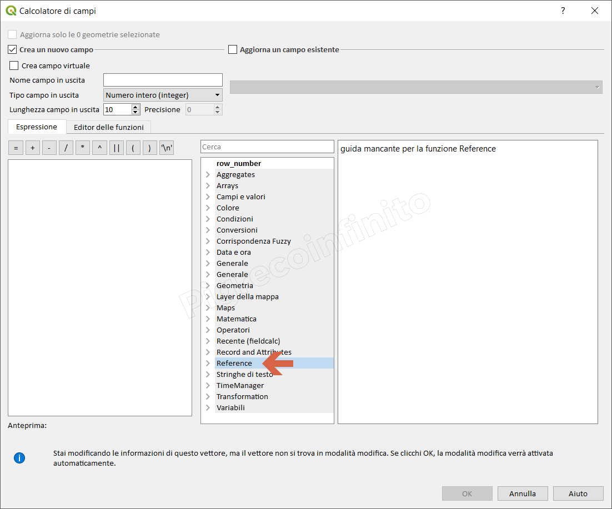

# README

Questo gruppo è presente SOLO dopo aver installato il [plugin](https://geogear.wordpress.com/2014/11/13/reffunctions-v1-0/) _refFunctions_. Plugin che aggiunge funzioni utente personalizzate al calcolatore di campi di QGIS per fare riferimento, analiticamente o spazialmente, tra i livelli, ad esempio recuperare un valore da un livello usando come valore di campo o una condizione spaziale \(interseca, disgiunti ....\) come parametro.

| Funzione | Descrizione |
| :---: | :--- |
| Funzioni della tabella: |  |
| [dbvalue](reference/funzioni/dbvalue.md) | Recupera il primo valore targetField da targetLayer quando keyField è uguale a conditionValue |
| [dbvaluebyid]() | Recupera il valore targetField da targetLayer usando l'ID della caratteristica interna |
| [dbquery]() | Recupera il primo valore targetField da targetLayer quando whereClause è true |
| [dbsql]() | Recupera i risultati dalla query SQL |
| Funzioni WKT: |  |
| [WKTcentroid]() | Restituisce il centro di massa della geometria data come geometria del punto WKT |
| [WKTpointonsurface]() | Restituisce il punto all'interno della geometria data |
| [WKTlenght]() | Restituisce la lunghezza della geometria WKT fornita |
| [WKTarea]() | Restituisce l'area della geometria WKT indicata |
| Funzioni geometriche: |  |
| [geomRedef]() | ridefinire la geometria della feature corrente con una nuova geometria WKT \(sperimentale!\) |
| [geomnearest]() | Recupera il valore del campo target dalla funzione di destinazione più vicina nel livello di destinazione |
| [geomdistance]() | Recupera il valore del campo target dalla funzione target nel livello di destinazione se la funzione target è in distanza |
| [geomwithin]() | Recupera il valore del campo obiettivo quando la funzione di origine si trova all'interno della funzione di destinazione nel livello di destinazione |
| [geomtouches]() | Recupera il valore del campo obiettivo quando la funzione sorgente tocca la funzione di destinazione nel livello di destinazione |
| [geomintersects]() | Recupera il valore del campo obiettivo quando la caratteristica sorgente interseca la caratteristica obiettivo nel livello di destinazione |
| [geomcontains]() | Recupera il valore del campo obiettivo quando la funzione di origine contiene la funzione di destinazione nel livello di destinazione |
| [geomcwithin](https://github.com/pigreco/HfcQGIS/tree/852bbb62a0d5b7739914d4de0ea5b1ebbb5d81d1/gr_funzioni/reference/funzioni/geomcwithin.md) | Recupera il valore del campo obiettivo quando la funzione di origine è disgiunta dalla funzione di destinazione nel livello di destinazione |
| [geomequals]() | Recupera il valore del campo obiettivo quando la funzione di origine è uguale alla funzione di destinazione nel livello di destinazione |
| [geomoverlaps]() | Recupera il valore del campo obiettivo quando la funzione sorgente si sovrappone alla funzione di destinazione nel livello di destinazione |
| [geomcrosses]() | Recupera il valore del campo obiettivo quando la caratteristica sorgente attraversa la caratteristica obiettivo nel livello di destinazione |

