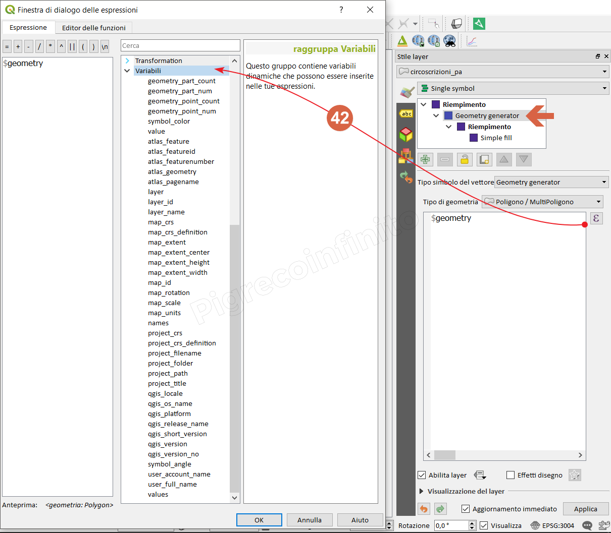

# README

[Funzionalità](http://nyalldawson.net/2015/12/exploring-variables-in-qgis-2-12-part-1/) introdotta da Nyall Dowson nella QGIS 2.12

Questo gruppo contiene variabili dinamiche relative all'applicazione, al file di progetto e ad altre impostazioni. Significa che alcune funzioni potrebbero non essere disponibili in base al contesto:

* seleziona per espressione 
* calcolatore di campi 
* geometry generator 
* proprietà del layer 
* compositore di stampe 

In QGIS, puoi utilizzare le variabili per memorizzare dati utili con valori ricorrenti \(ad esempio il titolo del progetto o il nome completo dell’utente\) che possono essere utilizzati nelle espressioni. Le variabili possono essere definite a livello globale dell’applicazione, a livello di progetto, a livello di layer, a livello di composizione e a livello di elemento del compositore. Proprio come le regole CSS a cascata, le variabili possono essere sovrascritte, ad esempio una variabile a livello di progetto sovrascrive le variabili di livello globale di qualsiasi applicazione impostate con lo stesso nome.

Puoi utilizzare queste variabili per creare stringhe di testo o altre espressioni personalizzate utilizzando il carattere @ prima del nome della variabile.

Riguardano:

| Funzione | Descrizione | applicazione |  |
| ---: | :--- | ---: |
| [atlas\_feature](variabili/funzioni/atlas_feature.md) | Ritorna la geometria attuale dell'atlante  \(come oggetto geometria\) | proprietà del layer, geometry generator |  |
| [atlas\_featureid](variabili/funzioni/atlas_featureid.md) | Ritorna ID della geometria attuale dell'atlante | proprietà del layer, geometry generator |  |
| [atlas\_featurenumber](variabili/funzioni/atlas_featurenumber.md) | Returns the current atlas feature number in the layout |  |  |
| [atlas\_filename](variabili/funzioni/atlas_filename.md) | Returns the current atlas file name |  |  |
| [atlas\_geometry](variabili/funzioni/atlas_geometry.md) | Returns the current atlas feature geometry | proprietà del layer, geometry generator |  |
| [atlas\_layerid](variabili/funzioni/atlas_layerid.md) | Returns the current atlas coverage layer ID |  |  |
| [atlas\_layername](variabili/funzioni/atlas_layername.md) | Returns the current atlas coverage layer name |  |  |
| [atlas\_pagename]() | Returns the current atlas page name | proprietà del layer, geometry generator |  |
| [atlas\_totalfeatures](variabili/funzioni/atlas_totalfeatures.md) | Returns the total number of features in atlas |  |  |
| [cluster\_color](variabili/funzioni/cluster_color.md) | Returns the color of symbols within a cluster, or NULL if symbols have mixed colors |  |  |
| [cluster\_size](variabili/funzioni/cluster_size.md) | Returns the number of symbols contained within a cluster |  |  |
| [geometry\_part\_count](variabili/funzioni/geometry_part_count.md) | Returns the number of parts in rendered feature’s geometry | proprietà del layer, geometry generator |  |
| [geometry\_part\_num](variabili/funzioni/geometry_part_num.md) | Returns the current geometry part number for feature being rendered | proprietà del layer, geometry generator |  |
| [geometry\_point\_count](variabili/funzioni/geometry_point_count.md) | Returns the number of points in the rendered geometry’s part | proprietà del layer, geometry generator |  |
| [geometry\_point\_num](variabili/funzioni/geometry_point_num.md) | Returns the current point number in the rendered geometry’s part | proprietà del layer, geometry generator |  |
| [grid\_axis](variabili/funzioni/grid_axis.md) | Returns the current grid annotation axis \(eg, ‘x’ for longitude, ‘y’ for latitude\) |  |  |
| [grid\_number](variabili/funzioni/grid_number.md) | Returns the current grid annotation value |  |  |
| [item\_id](variabili/funzioni/item_id.md) | Returns the layout item user ID \(not necessarily unique\) |  |  |
| [item\_uuid](variabili/funzioni/item_uuid.md) | Returns the layout item unique ID |  |  |
| [layer](variabili/funzioni/layer.md) | Returns the current layer | Calcolatore di campi,Seleziona per espressione,proprietà del layer, geometry generator |  |
| [layer\_id](variabili/funzioni/layer_id.md) | Returns the ID of current layer | Calcolatore di campi,Seleziona per espressione,proprietà del layer, geometry generator |  |
| [layer\_name](variabili/funzioni/layer_name.md) | Returns the name of current layer,proprietà del layer, geometry generator |  |  |
| [layout\_dpi](variabili/funzioni/layout_dpi.md) | Returns the composition resolution \(DPI\) |  |  |
| [layout\_name](variabili/funzioni/layout_name.md) | Returns the layout name | Calcolatore di campi,Seleziona per espressione |  |
| [layout\_numpages](variabili/funzioni/layout_numpages.md) | Returns the number of pages in the layout |  |  |
| [layout\_page](variabili/funzioni/layout_page.md) | Returns the page number of the current item in the layout |  |  |
| [layout\_pageheight](variabili/funzioni/layout_pageheight.md) | Returns the active page height in the layout \(in mm\) |  |  |
| [layout\_pagewidth](variabili/funzioni/layout_pagewidth.md) | Returns the active page width in the layout \(in mm\) |  |  |
| [map\_crs](variabili/funzioni/map_crs.md) | Returns the Coordinate reference system of the current map | proprietà del layer, geometry generator |  |
| [map\_crs\_definition](variabili/funzioni/map_crs_definition.md) | Returns the full definition of the Coordinate reference system of the current map | proprietà del layer, geometry generator |  |
| [map\_extent](variabili/funzioni/map_extent.md) | Returns the geometry representing the current extent of the map | proprietà del layer, geometry generator |  |
| [map\_extent\_center](variabili/funzioni/map_extent_center.md) | Returns the point feature at the center of the map | proprietà del layer, geometry generator |  |
| [map\_extent\_height](variabili/funzioni/map_extent_height.md) | Returns the current height of the map | proprietà del layer, geometry generator |  |
| [map\_extent\_width](variabili/funzioni/map_extent_width.md) | Returns the current width of the map | proprietà del layer, geometry generator |  |
| [map\_id](variabili/funzioni/map_id.md) | Returns the ID of current map destination. This will be ‘canvas’ for canvas renders, and the item ID for layout map renders | proprietà del layer, geometry generator |  |
| [map\_rotation](variabili/funzioni/map_rotation.md) | Returns the current rotation of the map | proprietà del layer, geometry generator |  |
| [map\_scale](variabili/funzioni/map_scale.md) | Returns the current scale of the map | proprietà del layer, geometry generator |  |
| [map\_units](variabili/funzioni/map_units.md) | Returns the units of map measurements | proprietà del layer, geometry generator |  |
| [parent](variabili/funzioni/parent.md) | Returns attributes and geometry from the parent feature when in the filter of the “aggregate” expression function |  |  |
| [project\_abstract](variabili/funzioni/project_abstract.md) | Returns the project abstract, taken from project metadata |  |  |
| [project\_author](variabili/funzioni/project_author.md) | Returns the project author, taken from project metadata |  |  |
| [project\_creation\_date](https://github.com/pigreco/HfcQGIS/tree/852bbb62a0d5b7739914d4de0ea5b1ebbb5d81d1/gr_funzioni/variabili/funzioni/project_creation_datemd/README.md) | Returns the project creation date, taken from project metadata |  |  |
| [project\_identifier](variabili/funzioni/project_identifier.md) | Returns the project identifier, taken from project metadata |  |  |
| [project\_keywords](variabili/funzioni/project_keywords.md) | Returns the project keywords, taken from project metadata |  |  |
| [project\_crs](variabili/funzioni/project_crs.md) | Returns the Coordinate reference system of the project | Calcolatore di campi,Seleziona per espressione, proprietà del layer, geometry generator |  |
| [project\_crs\_definition](variabili/funzioni/project_crs_definition.md) | Returns the full definition of the Coordinate reference system of the project | Calcolatore di campi,Seleziona per espressione | proprietà del layer, geometry generator |
| [project\_filename](variabili/funzioni/project_filename.md) | Returns the filename of current project | Calcolatore di campi,Seleziona per espressione, proprietà del layer, geometry generator |  |
| [project\_folder](variabili/funzioni/project_folder.md) | Returns the folder for current project | Calcolatore di campi,Seleziona per espressione, proprietà del layer, geometry generator |  |
| [project\_path](variabili/funzioni/project_path.md) | Returns the full path \(including file name\) of current project | Calcolatore di campi,Seleziona per espressione, proprietà del layer, geometry generator |  |
| [project\_title](variabili/funzioni/project_title.md) | Returns the title of current project | Calcolatore di campi,Seleziona per espressione, proprietà del layer, geometry generator |  |
| [qgis\_locale](variabili/funzioni/qgis_locale.md) | Returns the current language of QGIS | Calcolatore di campi,Seleziona per espressione, proprietà del layer, geometry generator |  |
| [qgis\_os\_name](variabili/funzioni/qgis_os_name.md) | Returns the current Operating system name, eg ‘windows’, ‘linux’ or ‘osx’ | Calcolatore di campi,Seleziona per espressione, proprietà del layer, geometry generator |  |
| [qgis\_platform](variabili/funzioni/qgis_platform.md) | Returns QGIS platform, eg ‘desktop’ or ‘server’ | Calcolatore di campi,Seleziona per espressione, proprietà del layer, geometry generator |  |
| [qgis\_release\_name](variabili/funzioni/qgis_release_name.md) | Returns current QGIS release name | Calcolatore di campi,Seleziona per espressione, proprietà del layer, geometry generator |  |
| [qgis\_short\_version](variabili/funzioni/qgis_short_version.md) | Returns current QGIS version short string | Calcolatore di campi,Seleziona per espressione, proprietà del layer, geometry generator |  |
| [qgis\_version](variabili/funzioni/qgis_version.md) | Returns current QGIS version string | Calcolatore di campi,Seleziona per espressione, proprietà del layer, geometry generator |  |
| [qgis\_version\_no](variabili/funzioni/qgis_version_no.md) | Returns current QGIS version number | Calcolatore di campi,Seleziona per espressione, proprietà del layer, geometry generator |  |
| [snapping\_results](variabili/funzioni/snapping_results.md) | Gives access to snapping results while digitizing a feature \(only available in add feature\) |  |  |
| [symbol\_angle](variabili/funzioni/symbol_angle.md) | Returns the angle of the symbol used to render the feature \(valid for marker symbols only\) | proprietà del layer, geometry generator |  |
| [symbol\_color](variabili/funzioni/symbol_color.md) | Returns the color of the symbol used to render the feature | proprietà del layer, geometry generator |  |
| [user\_account\_name](variabili/funzioni/user_account_name.md) | Returns the current user’s operating system account name | Calcolatore di campi,Seleziona per espressione | proprietà del layer, geometry generator |
| [user\_full\_name](variabili/funzioni/user_full_name.md) | Returns the current user’s operating system user name | Calcolatore di campi,Seleziona per espressione, proprietà del layer, geometry generator |  |
| [row\_number](variabili/funzioni/row_number.md) | Memorizza il numero della riga corrente | calcolatore campi |  |
| [value](variabili/funzioni/value.md) | Returns the current value |  |  |
| [with\_variable](variabili/funzioni/with_variable.md) | Allows setting a variable for usage within an expression and avoid recalculating the same value repeatedly |  |  |

Gruppo sul calcolatore di campi,Seleziona per espressione 

Geometry generator - stile  

Selezione per espressione  

Calcolatore di campi,Seleziona per espressione  

Compositore di stampe  

