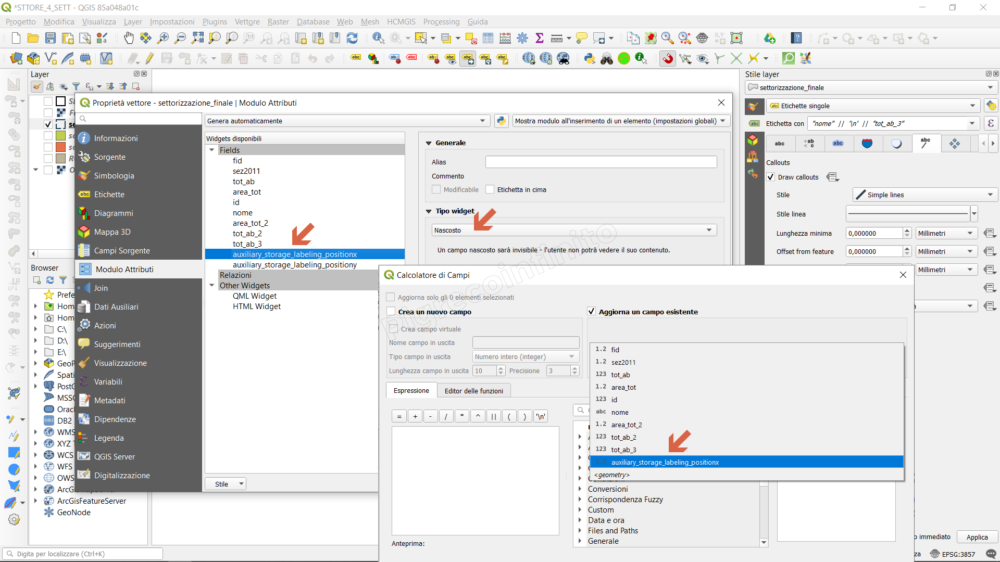

# Novità rilevanti introdotte nella 3.10

## Nuove funzioni

### Gruppo Record e Attributi

https://github.com/qgis/QGIS/pull/30440

### Aggiorna campi

https://github.com/qgis/QGIS/pull/31065

### Gruppo Data

https://github.com/qgis/QGIS/pull/31231

### Memorizza Filtro tabella attributi

https://github.com/qgis/QGIS/pull/31349

### Gruppo Geometria

- `make_line`, ora accetta anche array
- `collect_geometries`

https://github.com/qgis/QGIS/pull/31480

### Gruppo aggrega

https://github.com/qgis/QGIS/pull/31885