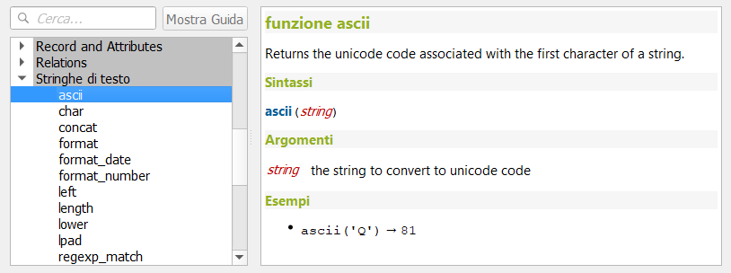
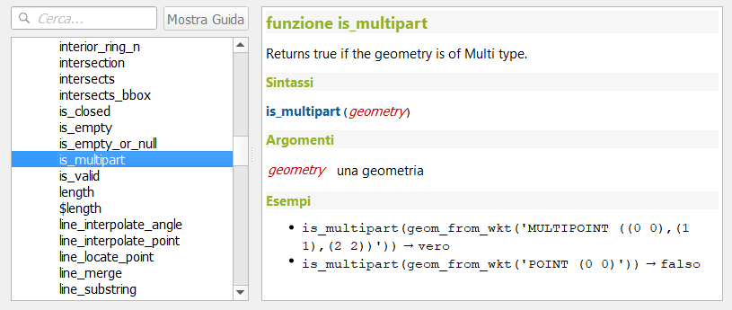
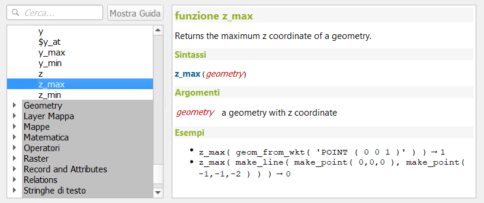
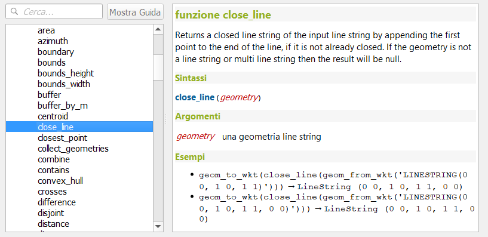
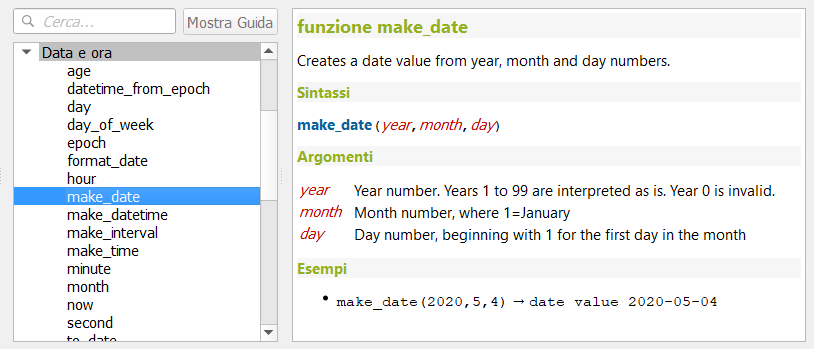
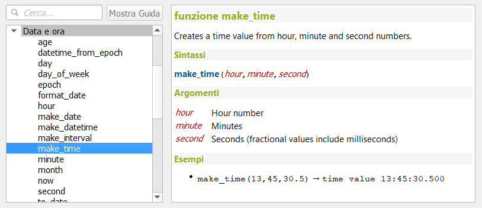
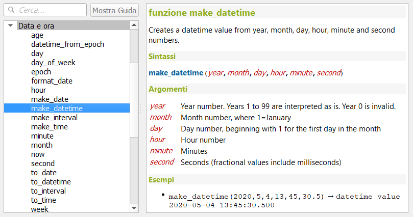
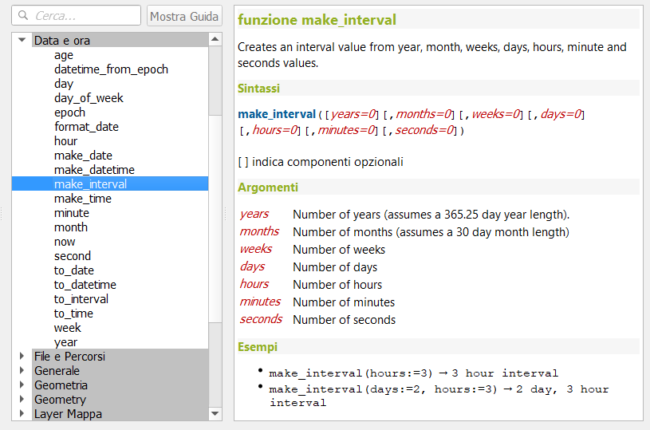

# Novità rilevanti introdotte nella 3.14 Pi (π)

<!-- TOC -->

- [Novità rilevanti introdotte nella 3.14 Pi (π)](#novità-rilevanti-introdotte-nella-314-pi-π)
  - [Nuove funzioni](#nuove-funzioni)
  - [Fix](#fix)
  - [GUI/UI/Forms](#guiuiforms)
  - [Variabili](#variabili)

<!-- /TOC -->

## Nuove funzioni

* **Ascii** : https://github.com/qgis/QGIS/pull/35839

* **is_multipart**: https://github.com/qgis/QGIS/pull/35889

* **min/max z** : https://github.com/qgis/QGIS/pull/35928

* **min/max m** : https://github.com/qgis/QGIS/pull/35928

* **close_line** : https://github.com/qgis/QGIS/pull/36069

* **make_date** : https://github.com/qgis/QGIS/pull/36245

* **make_time** : https://github.com/qgis/QGIS/pull/36245

* **make_datetime** : https://github.com/qgis/QGIS/pull/36245

* **make_interval** : https://github.com/qgis/QGIS/pull/36303

## Fix

* geom_from_gml: https://github.com/qgis/QGIS/pull/34931

## GUI/UI/Forms

* form: https://github.com/qgis/QGIS/pull/34827
  * current_feature;
  * current_geometry;
  * current_parent_feature;
  * current_parent_geometry;
  * currente_parent_value;
  * current_value;

* Edit,Import, export: https://github.com/qgis/QGIS/pull/34997

* sorting: https://github.com/qgis/QGIS/pull/36199

* widget tabs: https://github.com/qgis/QGIS/pull/35933

* Organize Columns: https://github.com/qgis/QGIS/pull/33918

* Allinea All Unique: https://github.com/qgis/QGIS/pull/34930

* preview: https://github.com/qgis/QGIS/pull/36089

## Variabili

* @frame_ :https://github.com/qgis/QGIS/pull/36300
  * @frame_number : numero del frame corrente;
  * @frame_rate : frame al secondo;
  * @frame_duration : lunghezza di frame;
* is_editable: https://github.com/qgis/QGIS/pull/35415
* @layer,@layer_ids: https://github.com/qgis/QGIS/pull/35208
  * @layers
  * @layer_ids
* expressions: https://github.com/qgis/QGIS/pull/34898
  * @map_start_time: Start of the map's temporal time range (as a datetime value)
  * @map_end_time: End of the map's temporal time range (as a datetime value)
  * @map_interval: Duration of the map's temporal time range (as an interval value)
* animation : https://github.com/qgis/QGIS/pull/36324
  * @animation_start_time;
  * @animation_end_time