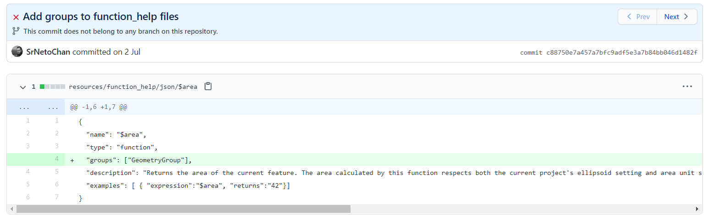
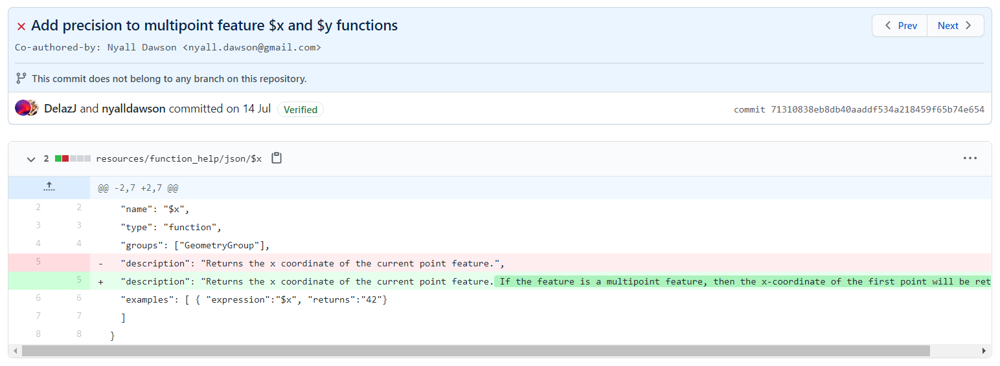
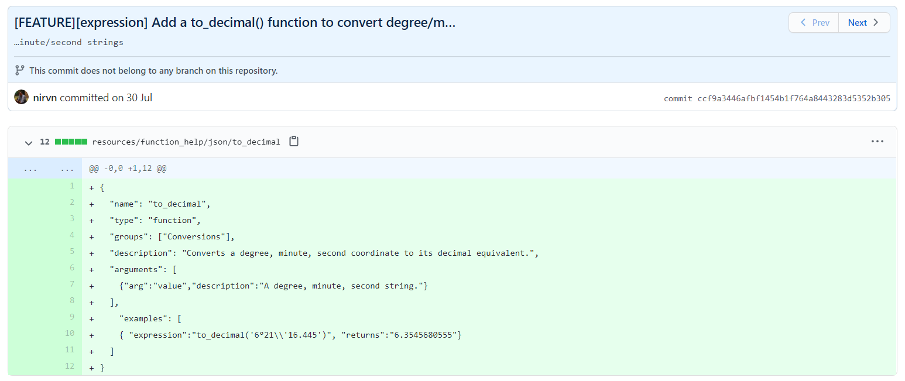
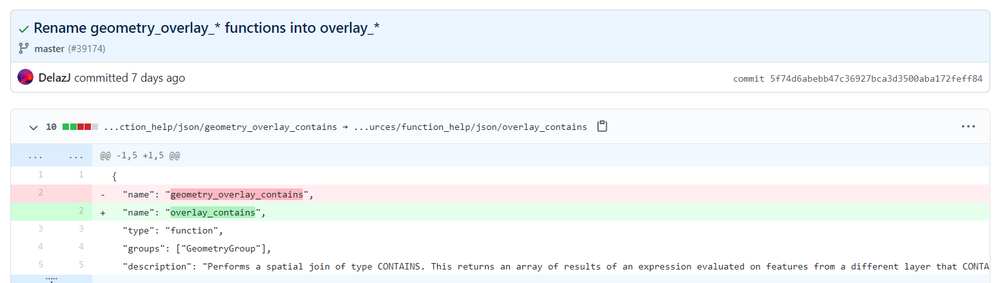

# Novità rilevanti introdotte nella 3.16

<!-- TOC -->

- [Novità rilevanti introdotte nella 3.16](#novità-rilevanti-introdotte-nella-316)
  - [Miglioramenti help in linea](#miglioramenti-help-in-linea)
  - [Nuove funzioni](#nuove-funzioni)

<!-- /TOC -->

## Miglioramenti help in linea

help in linea: https://github.com/qgis/QGIS/pull/37532



help in linea : https://github.com/qgis/QGIS/pull/37771



## Nuove funzioni

- `main_angle` : https://github.com/qgis/QGIS/pull/37798


- `to_decimal()` : https://github.com/qgis/QGIS/pull/38025



- refFunction: https://github.com/qgis/QGIS/pull/38405


```
overlay_intersects(layer[,expression][,filter][,limit][,cache])
overlay_contains(layer[,expression][,filter][,limit][,cache])
overlay_crosses(layer[,expression][,filter][,limit][,cache])
overlay_equals(layer[,expression][,filter][,limit][,cache])
overlay_touches(layer[,expression][,filter][,limit][,cache])
overlay_disjoint(layer[,expression][,filter][,limit][,cache])
overlay_within(layer[,expression][,filter][,limit][,cache])
overlay_nearest(layer[,expression][,filter][,limit][,max_distance][,cache])
```

- rename: https://github.com/qgis/QGIS/pull/39174 



