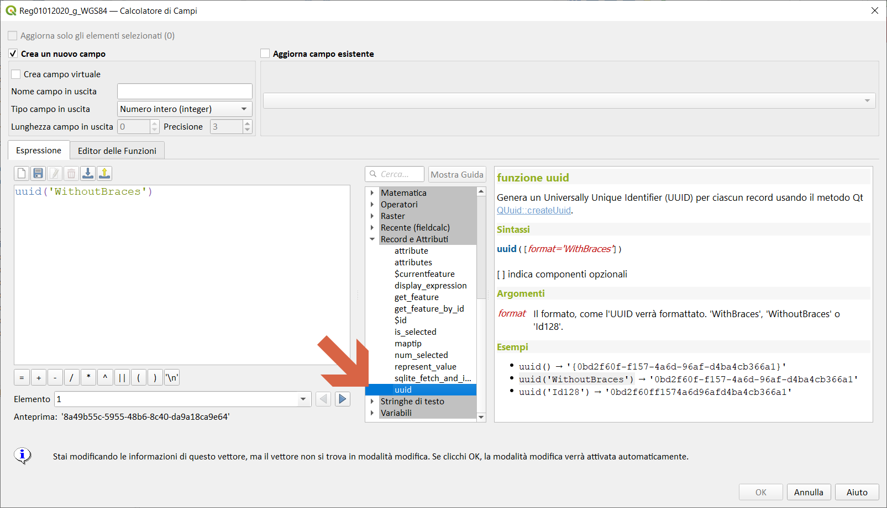
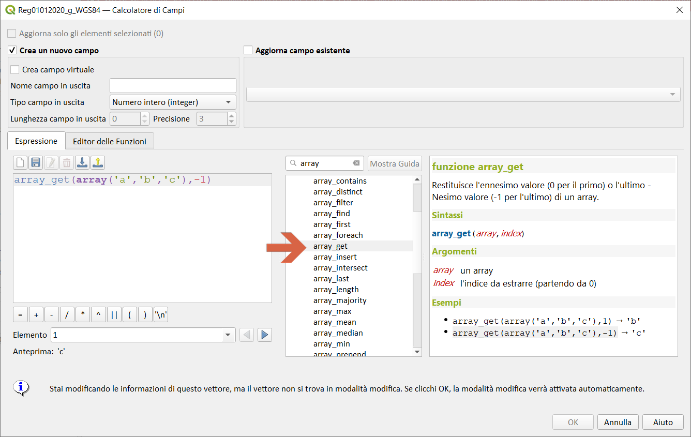
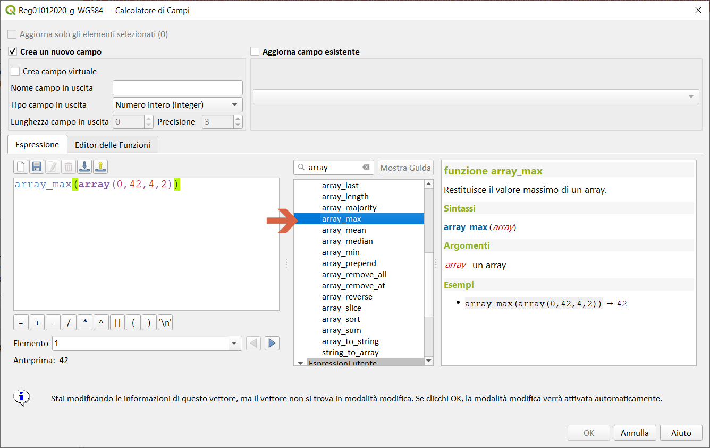
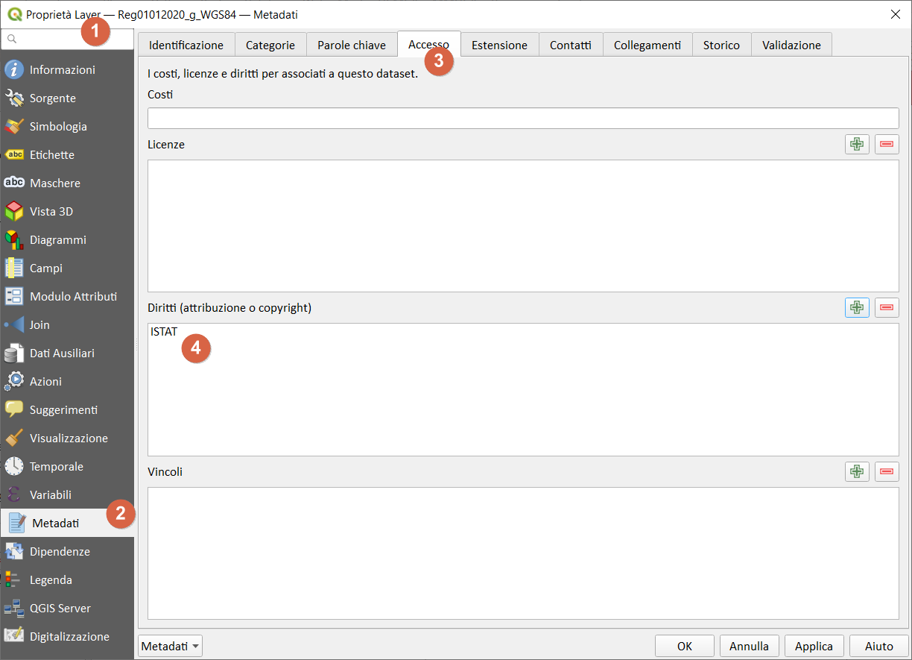
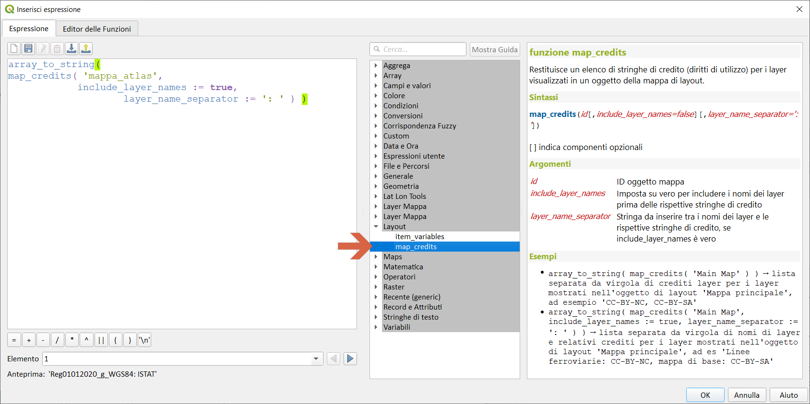
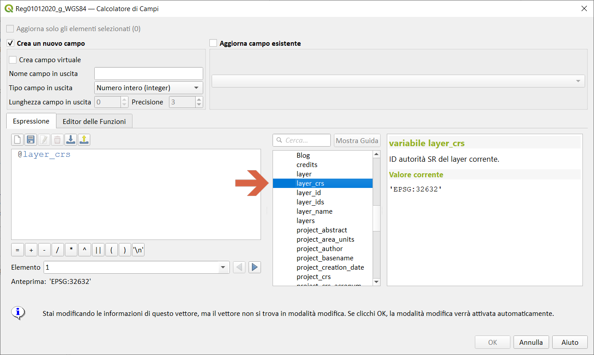
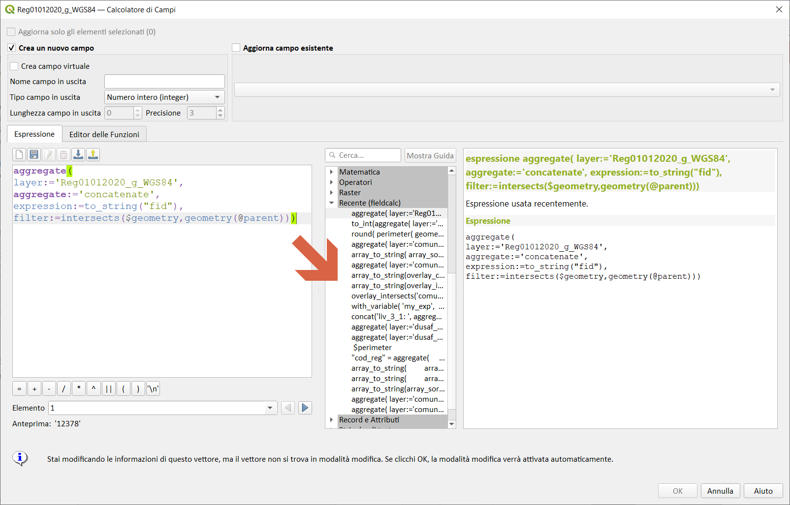

# Novità rilevanti introdotte nella 3.18

<!-- TOC -->

- [Novità rilevanti introdotte nella 3.18](#novità-rilevanti-introdotte-nella-318)
  - [Espressioni](#espressioni)
  - [GUI/UX](#guiux)

<!-- /TOC -->

## Espressioni

- `UUID` https://github.com/qgis/QGIS/pull/39414

- `Array_get` (supporta indici negativi) https://github.com/qgis/QGIS/pull/39921

- `array_min/max`, `array_majority`, `array_sum/mean/median` https://github.com/qgis/QGIS/pull/40364

- `map_credits` https://github.com/qgis/QGIS/pull/40919

- variabile `@layer_crs`

## GUI/UX
- Gruppo `recente` singola linea https://github.com/qgis/QGIS/pull/41545

