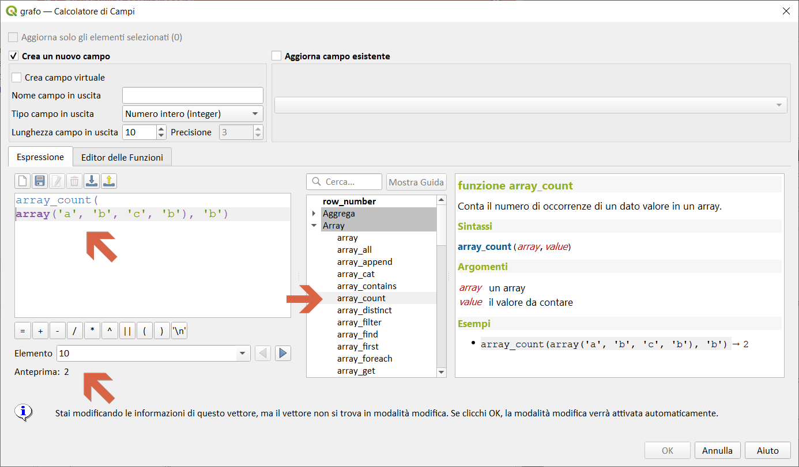
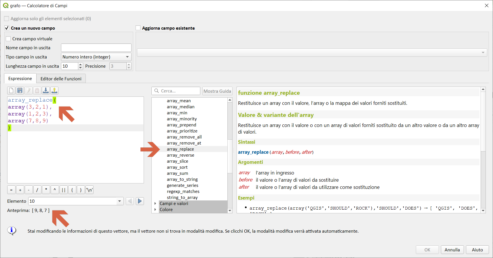
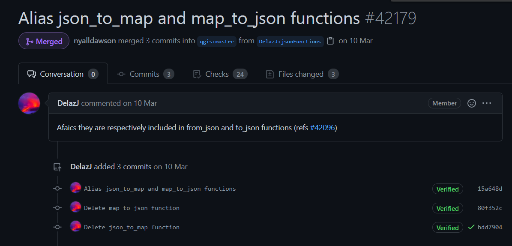
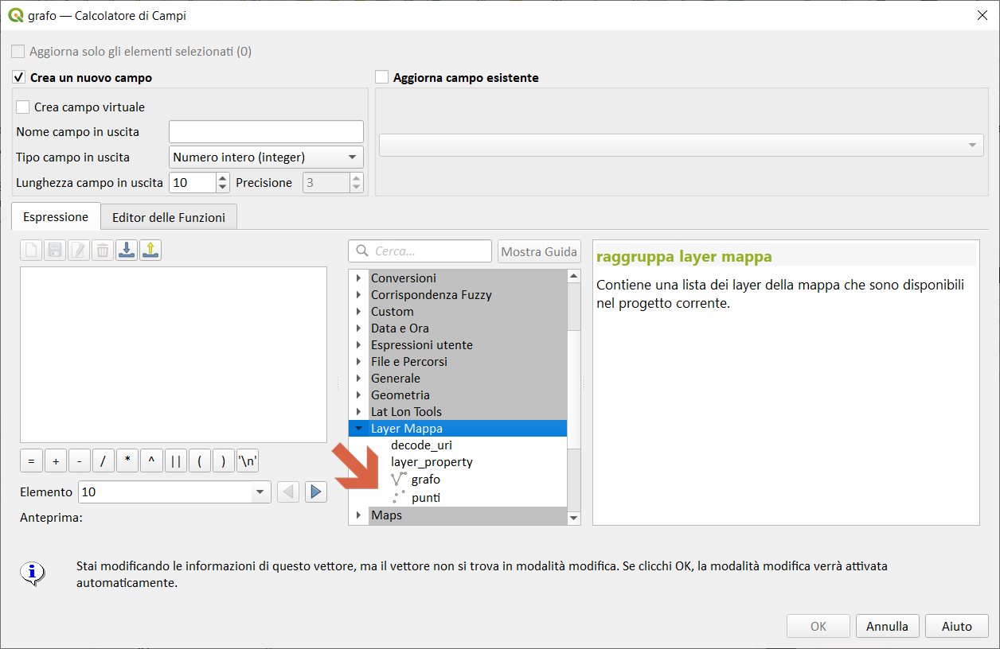
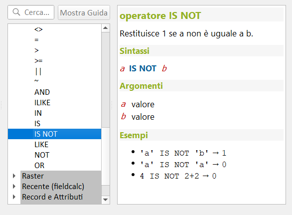

# Novità rilevanti introdotte nella 3.20 Odense

<!-- TOC -->

- [Novità rilevanti introdotte nella 3.20 Odense](#novità-rilevanti-introdotte-nella-320-odense)
  - [espressioni](#espressioni)
  - [tabella attributi](#tabella-attributi)
  - [GUI/UI](#guiui)

<!-- /TOC -->

## espressioni

- `length3D` : https://github.com/qgis/QGIS/pull/41127

- `array_count`: https://github.com/qgis/QGIS/pull/41338

- `array_priorize`: https://github.com/qgis/QGIS/pull/41338

- `array_replace` : https://github.com/qgis/QGIS/pull/41338

- `mime_type` : https://github.com/qgis/QGIS/pull/41191

- `alias` : https://github.com/qgis/QGIS/pull/42179

## tabella attributi

https://github.com/qgis/QGIS/pull/41276

## GUI/UI 

- icone : https://github.com/qgis/QGIS/pull/42168

- finestra dialogo: https://github.com/qgis/QGIS/pull/42745

- sintassi operatori: https://github.com/qgis/QGIS/pull/43134

